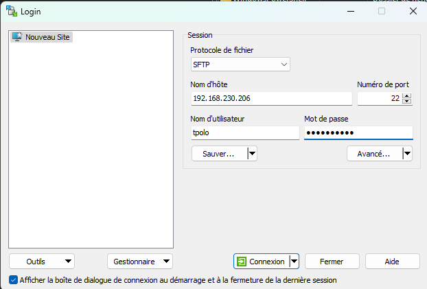
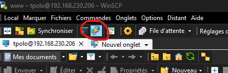

## Marche a suivre pour le deployement auto sur serveur nginx

# 1. Se connecter au serveur distant

Pour se connecter au serveur distant, installer WinScp : https://winscp.net/eng/downloads.php

Une fois installé lancer WinScp puis entrer les informations de connexion :

Assurez-vous de bien avoir la même ip que moi, le même port et que ce soit en mode sftp.

Cela va nous permettre de gérer les fichiers directement sur le serveur.

# 1.1 Installation et utilisation de Putty

Lien d'installation de Putty

https://www.chiark.greenend.org.uk/~sgtatham/putty/latest.html

Une fois installé, on peut l'utiliser directement dans WinScp. Ce qui va nous permettre de lancer des commandes

On peut le lancer grâce à cette icône

# 2 Configuration ssh entre le serveur et notre env local

- Pour commencer lancer l'invite de commande
- Lancer la commande : ssh-keygen -t rsa -b 4096
- Puis toujours dans l'invite de commande, se déplacer dans le dossier racine du projet où se trouve deployToProd.sh
- Lancer la commande : npm run deploy-prod
- Si tout va bien tout doit se lancer parfaitement, le cas échéant il faut le faire à la main tant pis

> Pour l'instant, j'ai fait un seul script pour intra prod et dev, le reste va arriver dès mon retour

# Pour lancer le deploy dev toutes les commandes sont dans le package.json genre npm run deploy-dev et le mdp c'est 25Alexia11$31 faut aussi s'assuré que tu as de quoi lancer les sh 

Fin du tuto.

# Si sa marches pas faut supprimer le system 32 ou demander a eric d'injecter sa dans L'as400 : DROP DATABASE ACTN
